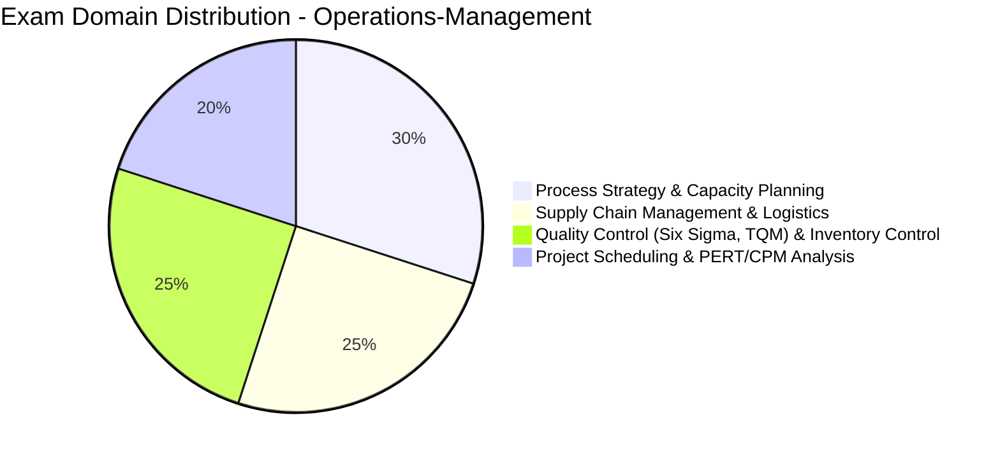

# Operations-Management: Operations Management Technical Reference

An end-to-end certification roadmap and practice repository for candidates preparing for the **Operations Management** (WGU).

## Executive Summary & Visual Domain Weights

## Technical Demo Practice Questions

Test your knowledge with these 10 scenario-based demo questions before sitting for the exam.

### Question 1
**In the context of Operations Management, which core objective is emphasized in the domain of Process Strategy & Capacity Planning?**

- A. Standardizing framework principles and applying best-practice operational methodologies
- B. Eliminating all documentation in favor of unverified deployment
- C. Relying exclusively on single-point-of-failure infrastructure
- D. Bypassing governance and compliance audits

**Correct Answer**: `A. Standardizing framework principles and applying best-practice operational methodologies`

**Explanation**: Competency in Process Strategy & Capacity Planning requires mastering industry-standard frameworks, analytical principles, and practical application skills.

---

### Question 2
**Which foundational concept in Operations-Management ensures data integrity and operational reliability across systems?**

- A. Defense-in-depth and structured verification controls
- B. Storing unencrypted passwords in plaintext configuration files
- C. Ignoring audit logs and monitoring alerts
- D. Disabling role-based access control (RBAC)

**Correct Answer**: `A. Defense-in-depth and structured verification controls`

**Explanation**: System stability and data assurance rely on multi-layered verification, role-based controls, and continuous monitoring.

---

### Question 3
**Which methodology or analytical approach is recommended when addressing complex problems within Quality Control (Six Sigma, TQM) & Inventory Control?**

- A. Systematic root-cause analysis and data-driven evaluation
- B. Trial-and-error changes made directly in live operational settings
- C. Ignoring stakeholder feedback and historical performance metrics
- D. Relying strictly on obsolete legacy standards

**Correct Answer**: `A. Systematic root-cause analysis and data-driven evaluation`

**Explanation**: Effective management and engineering in Quality Control (Six Sigma, TQM) & Inventory Control demand empirical analysis, structured problem solving, and evidence-based decision making.

---

### Question 4
**In the context of Operations Management, which core objective is emphasized in the domain of Project Scheduling & PERT/CPM Analysis?**

- A. Standardizing framework principles and applying best-practice operational methodologies
- B. Eliminating all documentation in favor of unverified deployment
- C. Relying exclusively on single-point-of-failure infrastructure
- D. Bypassing governance and compliance audits

**Correct Answer**: `A. Standardizing framework principles and applying best-practice operational methodologies`

**Explanation**: Competency in Project Scheduling & PERT/CPM Analysis requires mastering industry-standard frameworks, analytical principles, and practical application skills.

---

### Question 5
**Which foundational concept in Operations-Management ensures data integrity and operational reliability across systems?**

- A. Defense-in-depth and structured verification controls
- B. Storing unencrypted passwords in plaintext configuration files
- C. Ignoring audit logs and monitoring alerts
- D. Disabling role-based access control (RBAC)

**Correct Answer**: `A. Defense-in-depth and structured verification controls`

**Explanation**: System stability and data assurance rely on multi-layered verification, role-based controls, and continuous monitoring.

---

### Question 6
**Which methodology or analytical approach is recommended when addressing complex problems within Supply Chain Management & Logistics?**

- A. Systematic root-cause analysis and data-driven evaluation
- B. Trial-and-error changes made directly in live operational settings
- C. Ignoring stakeholder feedback and historical performance metrics
- D. Relying strictly on obsolete legacy standards

**Correct Answer**: `A. Systematic root-cause analysis and data-driven evaluation`

**Explanation**: Effective management and engineering in Supply Chain Management & Logistics demand empirical analysis, structured problem solving, and evidence-based decision making.

---

### Question 7
**In the context of Operations Management, which core objective is emphasized in the domain of Process Strategy & Capacity Planning?**

- A. Standardizing framework principles and applying best-practice operational methodologies
- B. Eliminating all documentation in favor of unverified deployment
- C. Relying exclusively on single-point-of-failure infrastructure
- D. Bypassing governance and compliance audits

**Correct Answer**: `A. Standardizing framework principles and applying best-practice operational methodologies`

**Explanation**: Competency in Process Strategy & Capacity Planning requires mastering industry-standard frameworks, analytical principles, and practical application skills.

---

### Question 8
**Which foundational concept in Operations-Management ensures data integrity and operational reliability across systems?**

- A. Defense-in-depth and structured verification controls
- B. Storing unencrypted passwords in plaintext configuration files
- C. Ignoring audit logs and monitoring alerts
- D. Disabling role-based access control (RBAC)

**Correct Answer**: `A. Defense-in-depth and structured verification controls`

**Explanation**: System stability and data assurance rely on multi-layered verification, role-based controls, and continuous monitoring.

---

### Question 9
**Which methodology or analytical approach is recommended when addressing complex problems within Quality Control (Six Sigma, TQM) & Inventory Control?**

- A. Systematic root-cause analysis and data-driven evaluation
- B. Trial-and-error changes made directly in live operational settings
- C. Ignoring stakeholder feedback and historical performance metrics
- D. Relying strictly on obsolete legacy standards

**Correct Answer**: `A. Systematic root-cause analysis and data-driven evaluation`

**Explanation**: Effective management and engineering in Quality Control (Six Sigma, TQM) & Inventory Control demand empirical analysis, structured problem solving, and evidence-based decision making.

---

### Question 10
**In the context of Operations Management, which core objective is emphasized in the domain of Project Scheduling & PERT/CPM Analysis?**

- A. Standardizing framework principles and applying best-practice operational methodologies
- B. Eliminating all documentation in favor of unverified deployment
- C. Relying exclusively on single-point-of-failure infrastructure
- D. Bypassing governance and compliance audits

**Correct Answer**: `A. Standardizing framework principles and applying best-practice operational methodologies`

**Explanation**: Competency in Project Scheduling & PERT/CPM Analysis requires mastering industry-standard frameworks, analytical principles, and practical application skills.

---

## Official Exam Blueprint & Specifications

### Exam Details
- **Exam Title**: Operations Management
- **Exam Code**: `Operations-Management`
- **Vendor**: WGU
- **Exam Duration**: 120 Minutes
- **Number of Questions**: 70
- **Passing Score**: 70%

### Curriculum Breakdown
| Domain / Objective | Weight |
| :--- | :--- |
| Process Strategy & Capacity Planning | 30% |
| Supply Chain Management & Logistics | 25% |
| Quality Control (Six Sigma, TQM) & Inventory Control | 25% |
| Project Scheduling & PERT/CPM Analysis | 20% |

## Study Roadmap & Practice Resources

A structured learning schedule ensures full coverage of all domain areas. For thoroughly verified questions and full-length exam simulations, visit [Operations-Management study guide](https://www.certsclub.com) to boost your test-taking confidence.
